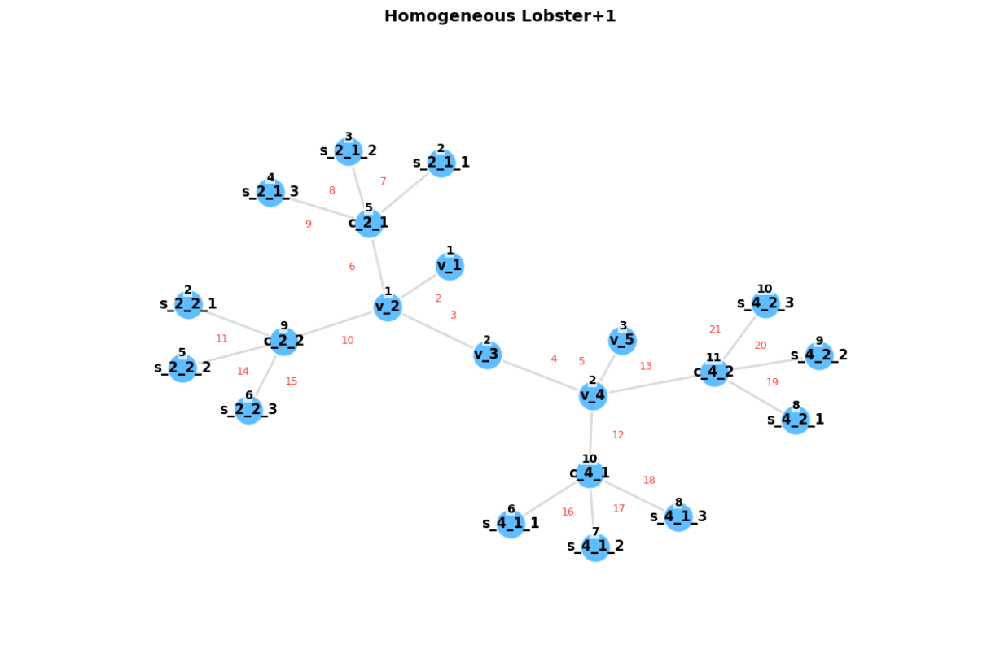
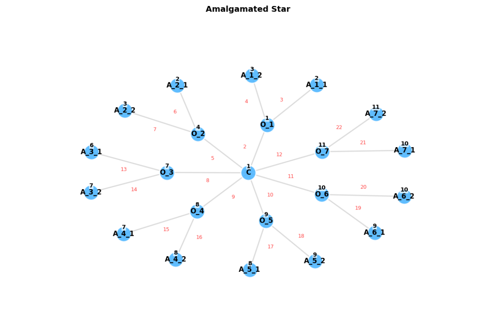
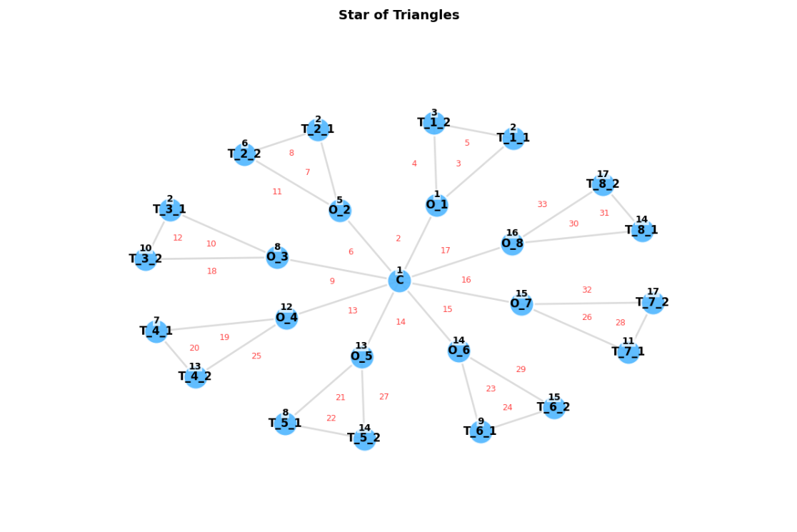
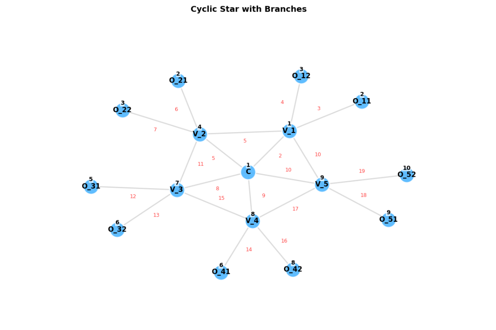

# Graph Structures Project

This project contains implementations of various graph structures, each with unique characteristics and properties. The
graphs are represented using Python and stored as adjacency lists.

## Graph Structures

### 1. Homogeneous Lobster Graph Plus 1 \( \{Lob}(n, p) \)

The **Lobster Graph** is constructed with a central path graph and two star graphs on each side for alternative nodes.

- **Description**:
    - A central path graph \( P_n \) with \( n \) vertices.
    - Two star graphs \( S_p \), each containing \( p \) vertices.
    - The central vertex of each star graph connects to every vertex of the path graph.

- **Total Vertices**:
  \[
  n(2p + 1) / 2
  \]

- **Vertex k-labeling**: The Lobster Graph allows for edge irregular k-labeling, ensuring that each edge has a unique
  weight.

### 2. Homogeneous Amalgamated Star \( S(n, m) \)

The **Homogeneous Amalgamated Star** graph consists of a central node connected to \( n \) outward vertices, with each
outward vertex connecting to \( m \) vertices.

- **Description**:
    - A central node that connects to \( n \) vertices.
    - Each of the \( n \) vertices is connected to \( m-1 \) additional vertices, forming a star-like structure.

- **Total Vertices**:
  \[
  m \times n + 1
  \]

- **Edge Irregular k-labeling**: This graph supports edge irregular labeling, ensuring all edge weights are distinct.

### 3. Amalgamated Triangle Star

The **Amalgamated Triangle Star** graph consists of a central node with \( n \) outward vertices, each forming a
triangle with two additional vertices.

- **Description**:
    - A central node connects to \( n \) outward vertices.
    - Each outward vertex forms a triangle with two additional vertices, creating a closed loop.

- **Graph Structure**:
    - Central Vertex: `C`
    - Outward Vertices: `O_i` (connected to `C`)
    - Triangle Vertices: `T_{i1}`, `T_{i2}` for each `O_i`

### 4. Cyclic Star with Branches

The **Cyclic Star with Branches** graph features a central vertex connected to \( n \) vertices arranged in a circular
manner, with each of these vertices having two outer vertices.

- **Description**:
    - A central vertex connects to \( n \) vertices.
    - Each vertex is connected in a circular formation (cycle).
    - Each vertex also has two outer vertices connected to it, which are not connected to each other.

- **Graph Structure**:
    - Central Vertex: `C`
    - Vertices: `V_i` (connected to `C` and each other)
    - Outer Vertices: `O_{ij}` for each `V_i`

## Installation

To run the code, you will need Python installed on your machine. Clone this repository and run the individual graph
construction functions provided in each graph section.

```bash
git clone https://github.com/Abhinav-Reddy-k/DAA.git
cd DAA
```

To install the required Python packages, use the following steps:

1. Ensure you have Python and `pip` installed. You can check this by running:
   ```bash
   python --version
   pip --version
    ```
2. Install the required packages using the following command:
3. ```bash
   pip install -r requirements.txt
   ```

Go to each file of a particular graph, adjust the parameters and just run the code.

## Images

### 1. Homogeneous Lobster Graph Plus 1



### 2. Homogeneous Amalgamated Star



### 3. Star of Triangles



### 4. Cyclic Star with Branches

